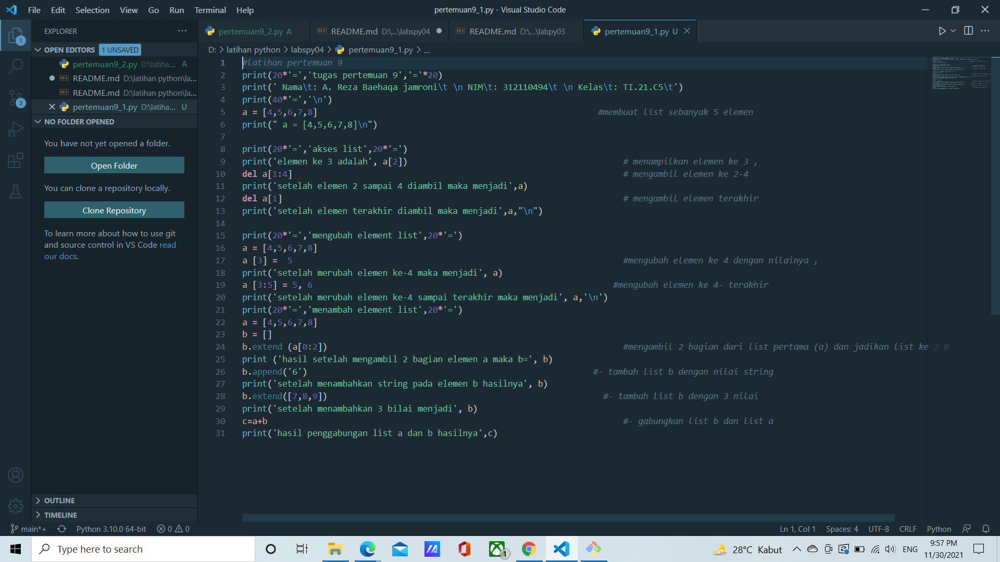
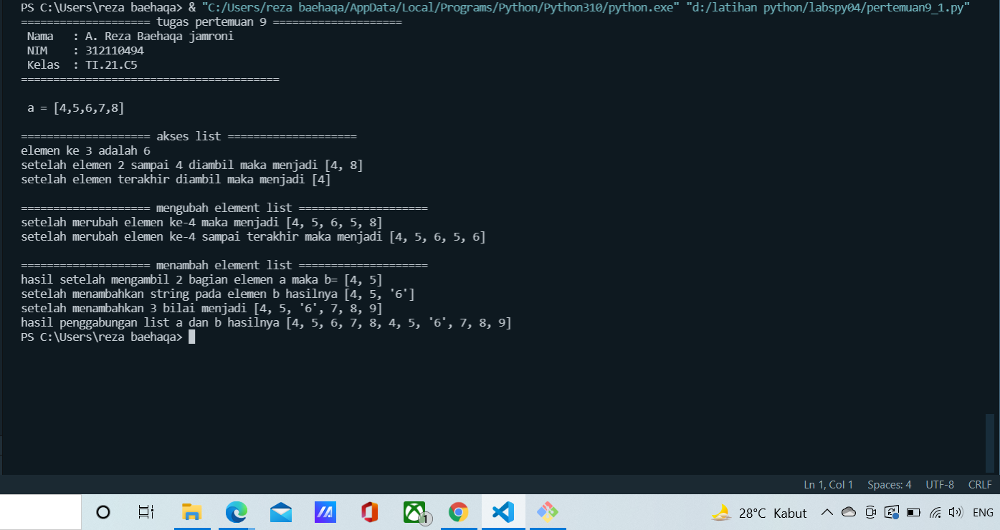
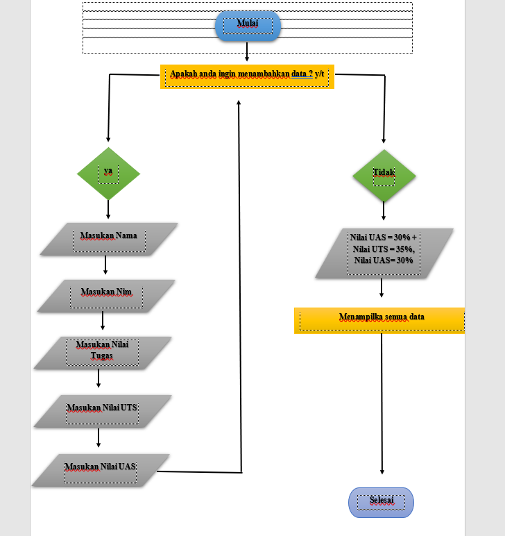
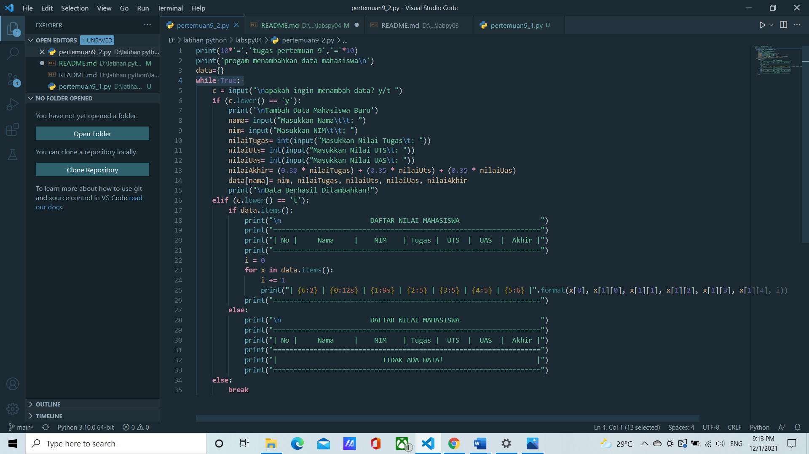
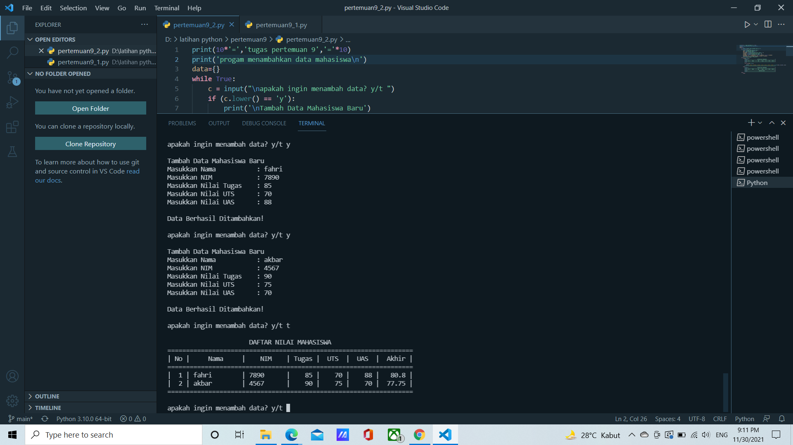

# labspy04
## Tugas Pertemuan ke 9
### Latihan
```sh
Nama    : A. Reza Baehaqa Jamroni
Nim     : 312110494
Matkul  : Bahasa Perograman
```
Latihan

• Buatlah sebuah list sebanyak 5 elemen dengan nilai bebas yaitu

```sh
a = [4,5,6,7,8]
```
• akses list:
    • tampilkan elemen ke 3
    • ambil nilai elemen ke 2 sampai elemen ke 4
    • ambil elemen terakhir
dari tiga akses list tersebut saya menggunakan cara sebagai berikut :
```sh 
print('elemen ke 3 adalah', a[2])                                           
del a[1:4]                                                                  
print('setelah elemen 2 sampai 4 diambil maka menjadi',a)                                                              
del a[1]                                                                    
print('setelah elemen terakhir diambil maka menjadi',a,"\n")
```
Dengan catatan 
*Nomer indeks list selalu dimulai dari nol (0).
*Nomer indeks ini yang kita butuhkan untuk mengambil isi (item) dari list.
• ubah elemen list:
    • ubah elemen ke 4 dengan nilai lainnya
    • ubah elemen ke 4 sampai dengan elemen terakhir
ini kita menggunakan cara sebagai berikut :
```sh
a [3] =  5                                                                  
print('setelah merubah elemen ke-4 maka menjadi', a)
a [3:5] = 5, 6                                                            
print('setelah merubah elemen ke-4 sampai terakhir maka menjadi', a,'\n')
```
• tambah elemen list:
    • ambil 2 bagian dari list pertama (A) dan jadikan list ke 2 (B)
    • tambah list B dengan nilai string
    • tambah list B dengan 3 nilai
    • gabungkan list B dengan list A
ini kita menggunakan cara sebagai berikut :
```sh
a = [4,5,6,7,8] 
b = []
b.extend (a[0:2])                                                           
b.append('6')                                                        
print('setelah menambahkan string pada elemen b hasilnya', b)
b.extend([7,8,9])                                                      
print('setelah menambahkan 3 bilai menjadi', b)
c=a+b                                                                       
print('hasil penggabungan list a dan b hasilnya',c)
```
Berikut ini adalah tampilan visual studio codenya

Berikut output dari programnya yang kita bikin


### Tugas Pratikum
Buat program sederhana untuk menambahkan data kedalam sebuah
list dengan rincian sebagai berikut:
• Progam meminta memasukkan data sebanyak-banyaknya (gunakan
perulangan)
• Tampilkan pertanyaan untuk menambah data (y/t?), apabila jawaban
t (Tidak), maka program akan menampilkan daftar datanya. • Nilai Akhir diambil dari perhitungan 3 komponen nilai (tugas: 30%,
uts: 35%, uas: 35%)
• Buat flowchart dan penjelasan programnya

sebelum membuat programnya kita lihat dulu alur flowchartnya, sebagai acuan dalam pengambilan keputusan guna memudahkan dalam urutan proses pembuatanya :

1. pertama saya membuat inputan dan looping agar program terus berjalan
```sh
while True: 
c = input("\napakah ingin menambah data? y/t ")
```
2. kemudian membuat fungsi if apabila menginput 'y'
3. percabangan if untuk apabila menginput 't'
4. terakhir saya menggunakan else break untuk menyetop loopingan yang kita bikin

Berikut screenshot dari program pada visual studio code yang kita bikin:

Berikut output dari programnya yang kita bikin


